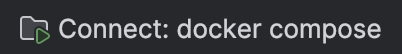
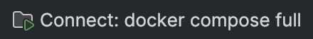
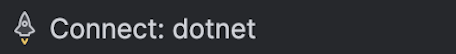

# Introduction
SchoolAccount-Connect is an ASP.NET Core web application that provides the public-facing frontend for the DfE School 
Account service. It handles user authentication via DfE Sign In and acts as the primary entry point for schools 
interacting with the platform.

## Documentation

- [Clean Architecture](docs/clean-architecture.md) - layers, dependency rules, and code organisation
- [Coding Standards](docs/coding-standards.md) - coding conventions, CQRS patterns, testing, and repository standards
- [Instrumentation](docs/instrumentation.md) - logging, metrics, distributed tracing, and analytics events
- [Project Structure](docs/project-structure.md) - solution layout, feature organisation, and Web.Connect folder conventions

# Getting Started
Follow these steps to start the web application locally.

1. Install prerequisites - see [Prerequisites](docs/prerequisites.md) for detailed instructions:
   - Docker Desktop
   - Rider or Visual Studio Code
   - .NET 10 SDK
   - Related repositories, you can use a clone script in [SchoolAccount-LocalDevTools](https://dfe-gov-uk.visualstudio.com/s268-schoolaccount/_git/SchoolAccount-LocalDevTools?path=/scripts)
     to do this

2. Run the appropriate initialization script for your OS. This will:
   - Installs dotnet tools for CSharpier formatter
   - Generates SSL certificates via mkcert for running on https locally, 
   - Downloads the DfE VPN root CA
   - Sets up your `DEV_PAT` in your shell profile which is used for authentication with Azure Package Feeds

       | macOS / Linux | Windows PowerShell |
       |---------------|--------------------|
       | `./init.sh`   | `.\init.ps1`       |

    >    You will be prompted for a Personal Access Token (PAT) if `DEV_PAT` is not already set in your environment. 
         The script will persist it to your shell profile for future sessions. 
         See [Personal Access Token](docs/personal-access-token.md) for instructions on generating one.

3. Starting the app in Rider:
   - Open the project in Rider
   - Use Rider's run configurations from the toolbar

     | Run Configuration                                         | Type     | Outcome                                                                                                                                           |
     |-----------------------------------------------------------|----------|---------------------------------------------------------------------------------------------------------------------------------------------------|
     |       | Compound | Starts the Connect app and its direct dependencies (database, migrations, app-config-emulator, seq) via Docker Compose and launches a browser     |
     |  | Compound | Starts all services including TSI Frontend, TSI Backend, TSI Domain Service, and SchoolAccount Frontend via Docker Compose and launches a browser |
     |                 | Dotnet   | Runs the app directly using `dotnet run` against an `https` launch profile, no dependencies are started                                           |

4. Once running, the application is available at `https://127.0.0.1:7034/`
   > We have to use an IP address due to restrictions on acceptable redirect URLs from DfE Sign-In which disallows
     localhost

5. Debugging guidance:
   - Set breakpoints in your C# files under `src/SchoolAccount.Web.Connect` any of the above run configurations will 
     automatically start the app with debugging enabled.
   - Structured logs are available in Seq at `http://localhost:5341` when running via Compound run configurations.

# Build and Test
Use the .NET CLI to build or test the application.

- To build locally:
  ```bash
  dotnet build
  ```

- To run all tests:
  ```bash
  dotnet test
  ```

- To run a specific test project:
  ```bash
  dotnet test tests/SchoolAccount.Application.UnitTests
  ```

The solution includes unit, integration, conformance, and web tests under the `tests/` directory.
  
## Architecture

The solution follows a clean architecture pattern with vertical slice features:

| Project                               | Purpose                                                                       |
|---------------------------------------|-------------------------------------------------------------------------------|
| `SchoolAccount.Web.Connect`           | ASP.NET Core MVC web app — controllers, views, middleware                     |
| `SchoolAccount.Application`           | CQRS handlers, feature logic (Tasks, Categories, Calendar of Items, Feedback) |
| `SchoolAccount.Domain`                | Domain entities and business rules                                            |
| `SchoolAccount.Infrastructure`        | EF Core, SQL Server, Azure App Configuration, external integrations           |
| `SchoolAccount.Kernel`                | Shared primitives — `Result<T>`, `Error`, `Entity`, `IUserContext`            |
| `SchoolAccount.Integration.DfESignIn` | DfE Sign-In authentication integration                                        |

See more on [Clean Architecture](docs/clean-architecture.md)

## Logging

Structured logs are written to [Seq](https://datalust.co/seq). When running via Docker Compose, the Seq UI is available at http://localhost:5341.

## Contributing

1. Branch from `main` using the convention `feature/<short-description>` or `bugfix/<short-description>` or `task/<short-description>`'
2. Husky pre-commit hooks run CSharpier formatting checks.
3. Open a pull request [here](https://dfe-gov-uk.visualstudio.com/s268-schoolaccount/_git/SchoolAccount-Connect/pullrequests) against `main` and fill in the pull request template.
