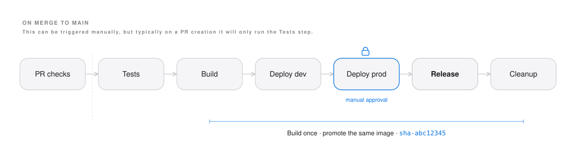
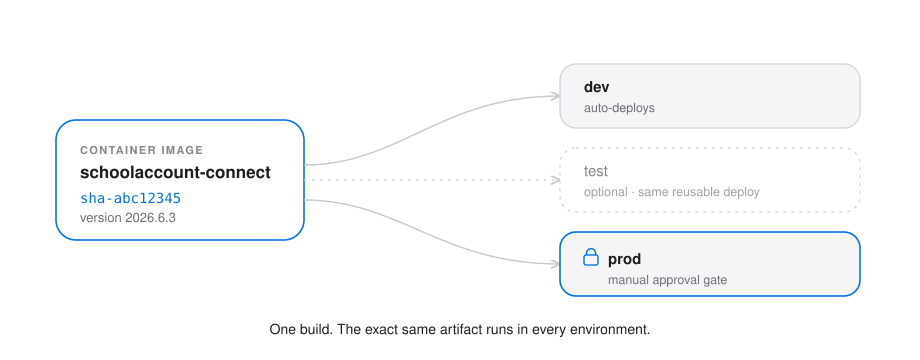
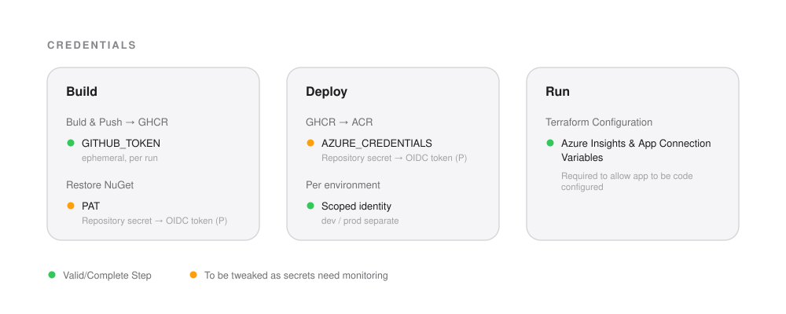

# Github Actions
Pull requests, testing and deployment pipeline breakdown.

## Overview

How this service is built, versioned, tested, and shipped to Azure Container Apps. The pipeline runs on GitHub Actions, the image lives in GitHub Container Registry (GHCR), and all infrastructure is managed with Terraform.

The guiding principle is **build once, promote the same artifact**: a single image is built per commit, tagged immutably, and that exact image is what runs in every environment up to production.

---

## Pipeline at a glance



On a **pull request**, the test suite runs as a merge gate. On a **merge to `main`**, the full pipeline runs: tests, then one image build, then deploy to dev, deploy to prod behind a manual approval, and finally cut a release.

| Stage | Trigger | What it does |
|-------|---------|--------------|
| PR checks | PR to `main` | Runs the full test suite; blocks the merge on failure |
| Tests | merge to `main` | Same suite again, gating the build |
| Build | after tests | Builds the image **once**, tags it with the commit SHA, pushes to GHCR |
| Deploy dev | after build | `terraform apply` deploys the image to dev (no gate) |
| Deploy prod | after smoke | Same image to prod, behind a GitHub Environment approval gate |
| Release | after prod | Creates a GitHub Release from the deployed version |

---

## Build once, promote many



The image is built a single time and pushed to GHCR tagged with the 8-bit short commit SHA (e.g. `sha-abc12345`). Every deploy job consumes that **same** tag, so what runs in production is provably the same bytes that passed dev and smoke tests, no rebuilds, no drift. Terraform owns the running image (the tag is passed in as a variable), so nothing changes the deployment out-of-band.

A second, human-friendly version tag (see below) is pushed alongside the SHA tag, pointing at the same image.

When the release step has been triggered will attach a `:latest` tag to the release, allowing anyone wanting to consume the latest image to do so.

---

## Versioning

The app is versioned automatically using calendar versioning, `year.month.revision`, with the commit SHA attached for traceability.


- **Revision** is the number of commits in the current month, so it **resets on the 1st** and stays small (well clear of the assembly-version part limit).
- The version is injected into the build, so `FileVersion`/`AssemblyVersion` carry the clean numeric `2026.6.3`, and `InformationalVersion` carries `2026.6.3+abc12345`.
- In the future it could be read at runtime (e.g. a `/version` or `/about` endpoint) from the `AssemblyInformationalVersionAttribute`.

The computation lives in a reusable composite action at `.github/actions/compute-version`, which outputs `version`, `sha`, and `tag`. Any workflow in the repo can call it. Note it requires the calling job to check out with `fetch-depth: 0`, because the monthly count needs full git history, the action fails fast with a clear message if the checkout is shallow.

---

## Authentication & secrets

The pipeline is built to avoid long-lived credentials wherever possible.



- **Pushing the image** to GHCR uses the built-in `GITHUB_TOKEN`, ephemeral, scoped to the run.
- **Deploying to Azure** uses a provided `AZURE_CRED` [to complete]
- **Restoring NuGet** packages from the private Azure DevOps feed currently uses a PAT (`AZURE_DEVOPS_PAT`), passed into the build only as a BuildKit secret. This is the next credential to remove, either by minting a short-lived OIDC, or by moving the packages to GitHub Packages and authenticating with `GITHUB_TOKEN`.
- **Pulling the image** [to complete]

See the "Planned improvements" section for the path to a fully credential-less pipeline.

---

## Repository layout

```
.github/
  actions/
    compute-version/        # composite action: CalVer + SHA + image tag
  workflows/
    pr_health_check.yml     # PR gate, runs the tests
    build.yml               # main orchestrator (test -> build -> deploy -> release)
    _test.yml               # reusable: unit matrix + integration + results summary
    _deploy.yml             # reusable: terraform apply for one environment
terraform/
  environments/             # per-env config + remote state key
    dev/       
    prod/
src/
  SchoolAccount.Web.Connect/
    Dockerfile              # multi-stage build
tests/                      # unit, integration, etc test projects
```

### SchoolAccount.Web.Connect Dockerfile

A multi-stage build in `src/SchoolAccount.Web.Connect/Dockerfile`. The important detail is that the **production path is cert-free**:

- `base` and `final` (the production image) contain no local certificates. Production talks to public endpoints whose CAs are already trusted, so nothing extra is needed, and this is what lets CI build the image without the local `certs/rootCA.crt` file present.
- Local-development certificate trust (for the VPN/corporate root CA) lives only in dev-only stages (`debug`, `final-dev`). Because `final` doesn't depend on them, CI never builds those stages and never needs the cert file.
- `final` must remain the **last** stage so a plain build and CI both target the production image by default. CI also pins `target: final` explicitly.
- NuGet restore happens inside the build stage using a BuildKit secret (`--mount=type=secret`), so the feed credential never lands in an image layer.

The version is passed in via build args (`VERSION`, `GIT_SHA`) and applied with `-p:Version` and `-p:SourceRevisionId`.

---

## Testing

Three layers, each at the right point in the pipeline:

- **Unit tests** run as a parallel matrix (one job per test project) with `fail-fast: false`, so every project reports.
- In the future _true_ **Integration tests** could then run against a real database provided as a service container.
- In the future _true_ **e2E tests** could then run against a real database provided as a service container like the integration but allow for `trait` filtering to allow for quicker more intended runs against merges.

Results are aggregated and published to the run via `dorny/test-reporter` with `use-actions-summary: true`, so pass/fail and coverage appear on the run summary page, not just buried in logs. The `ci-pr.yml` and `pipeline.yml` workflows both call the same `_test.yml`, so the merge gate and the deploy gate run an identical suite.

The step for the Integration tests or any E2E testing could be outlined similiar to the following
```yaml
integration-tests:
    name: Integration ${{ matrix.project.name }}
    runs-on: ubuntu-latest
    strategy:
      fail-fast: false
      matrix:
        project:
          - { name: Integration.CalendarOfItems,   path: tests/SchoolAccount.Integration.CalendarOfItems }
          - { name: Integration.Personalisation,   path: tests/SchoolAccount.Integration.Personalisation }
    services:
      postgres:
        image: postgres:16
        env:
          POSTGRES_PASSWORD: postgres
          POSTGRES_DB: schoolaccount_test
        ports: ['5432:5432']
        options: >-
          --health-cmd pg_isready
          --health-interval 10s
          --health-timeout 5s
          --health-retries 5
    steps:
      - uses: actions/checkout@v4
      - uses: actions/setup-dotnet@v4
        with:
          dotnet-version: ${{ inputs.dotnet-version }}
      - name: Test
        env:
          ConnectionStrings__Database: "Host=localhost;Port=5432;Database=schoolaccount_test;Username=postgres;Password=postgres"
        run: |
          dotnet test tests/SchoolAccount.IntegrationTests \
            --configuration Release \
            --logger "trx;LogFileName=${{ matrix.project.name }}.trx" \
            --results-directory ./test-results
      - name: Upload results
        if: always()
        uses: actions/upload-artifact@v4
        with:
          name: integration-results
          path: ./test-results
```
The above example shows a matrix of _integration_ projects which require a database container and how they can be set up.

## Environments & promotion

Each environment is an isolated Terraform configuration with its own remote state file. Environments are defined as **GitHub Environments** so that protection rules apply:

- **dev**, deploys automatically, no gate.
- **test**, will require manual approval before the deploy runs, but does need to be included into the action.
- **prod**, requires manual reviewer approval before the deploy runs.

The deploy logic is a single reusable workflow (`_deploy.yml`) called once per environment, so adding staging (or any environment) is one extra job, not a copy-paste of the deploy steps.

_The number of enviroments does need dicussed on and then confirmed._

---

## Releases

When a prod deploy succeeds, a GitHub Release is created automatically from that build:
- Tagged with the version (`v2026.6.3`) at the production commit.
- The deployed image reference is included at the top of the notes.

This that will be added later on:

- Notes are **categorised** by PR label (Features / Fixes / Maintenance) via `.github/release.yml`.
- A **Work items** section is appended by scanning commit messages since the previous release for work-item references (`AB#1234` for Azure Boards; adaptable to GitHub Issues or Jira) and linking each one.

Because the release hangs off the prod deploy, every release is a precise record of what is actually in production, the tag, the assembly version, and the image all line up on the same commit.

---

## Local development

You can validate most of the pipeline before pushing:

- **Tests** run natively in Rider; integration tests need Docker running for the database.
- **The image** builds locally with the same command CI uses, BuildKit on, the PAT supplied as a secret, targeting `final`:
  ```bash
  DOCKER_BUILDKIT=1 docker build \
    --secret id=personal_access_token,env=AZURE_DEVOPS_PAT \
    --target final -t schoolaccount-connect:local .
  ```
  Use `--target debug` or `--target final-dev` for the cert-trusting dev images.
- **The workflows** can be dry-run with [`act`](https://github.com/nektos/act) for the test and build jobs (the secret deploy jobs can't run locally and shouldn't be attempted under `act`).
- **Terraform** validates offline with `terraform init -backend=false && terraform validate`.

---

## _First-time_ setup

The pipeline assumes the following have been provisioned once.

1. An Azure Storage account for Terraform remote state, with a separate state key per environment.
3. GitHub Environments (`dev`, `prod`) with protection rules and environment-scoped secrets.
4. The GHCR pull token and the Azure DevOps feed credential as secrets.
5. A branch-protection rule on `main` requiring the PR checks workflow to pass.

---

## Maintenance notes

- **Action versions / Node 24.** GitHub is moving Actions runners to Node 24. The workflows use the current major versions (`actions/checkout@v5`, `docker/login-action@v4`, `docker/setup-buildx-action@v4`, `docker/build-push-action@v7`). When bumping any action, confirm its `action.yml` declares `using: node24`.
- **PAT rotation.** Until the planned improvements land, the Azure DevOps feed PAT are long-lived and must be rotated on a schedule.

---

## Planned improvements

These move the pipeline toward zero stored credentials and tighter consolidation onto GitHub:

1. **Remove the NuGet PAT**, either mint a short-lived Entra token via the existing OIDC federation and feed it to the restore, or migrate the packages to GitHub Packages and authenticate with `GITHUB_TOKEN`.
2. **Add all required _deploy_ enviroments** to the action between dev and prod if any pre-production gates are required, a single extra job using the existing reusable deploy workflow.

Here is a list of extensions or ideas that could be added:

- [Ability to send a create/close change requests to ServiceNow](ideas/servicenow-change-request.md).
