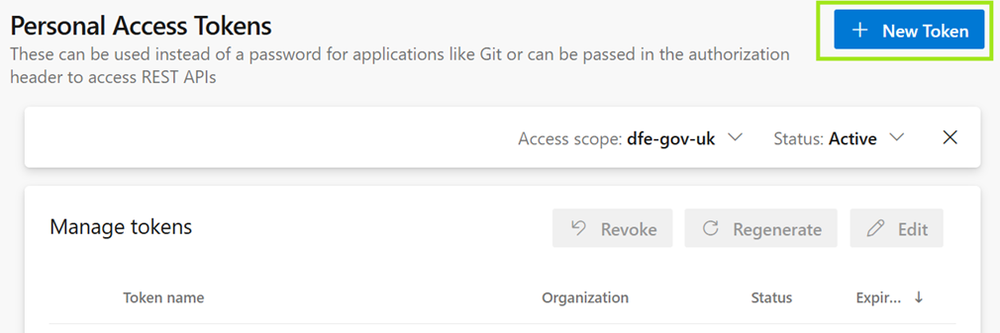
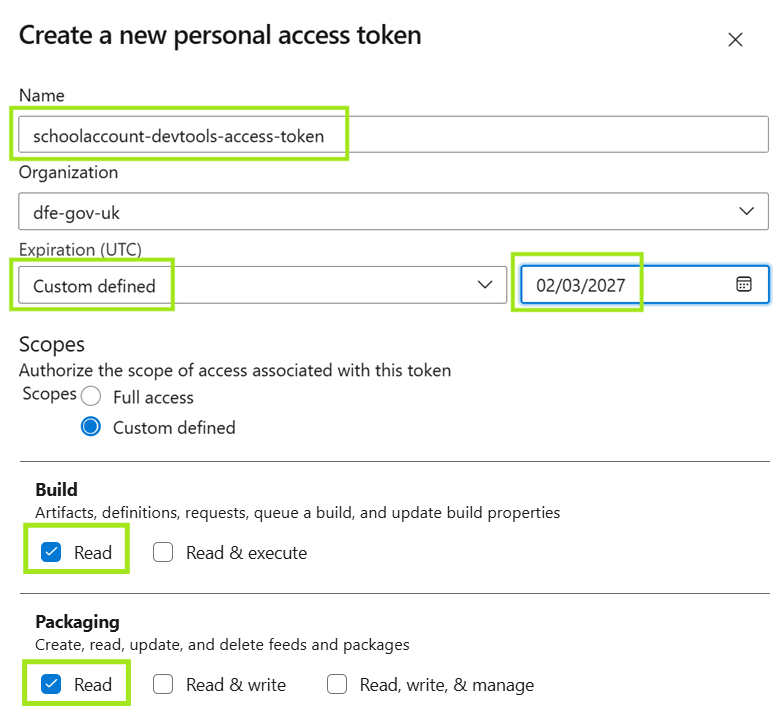
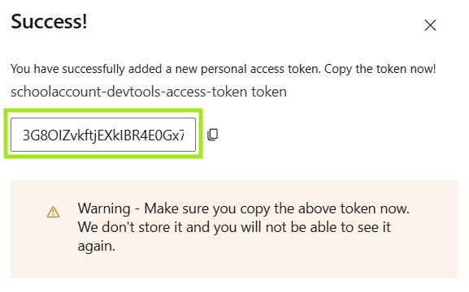

# Personal Access Token (PAT)

A Personal Access Token is required to authenticate with Azure DevOps when pulling private NuGet packages and Docker 
images during the build.

## Generating a Token

1. Navigate to [Azure DevOps User Tokens](https://dfe-gov-uk.visualstudio.com/_usersSettings/tokens) and 
   click `+ New Token`:

   

2. Enter a descriptive name, choose `Custom defined` in the `Expiration` field, choose a date one year in the future, 
   and select `Read` in the `Build` & `Packaging` section:

   

3. Copy the token displayed on the next screen — this is the only time it will be visible:

   

## Using the Token

When you run `init.sh` (macOS / Linux) or `init.ps1` (Windows) for the first time, you will be prompted to enter this token. It will be stored as the `DEV_PAT` environment variable in your shell profile (`~/.zshrc` or `~/.bashrc`) so you won't need to enter it again.

If your token expires, you can generate a new one following the steps above and re-run the init script to update it.
