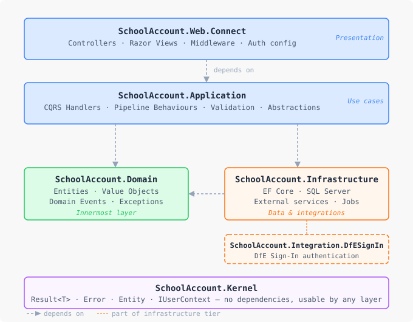

---

## Solution Layout

```
SchoolAccount-Connect/
├── src/
│   ├── SchoolAccount.Domain/               # Innermost layer - business rules
│   ├── SchoolAccount.Application/          # Use cases and CQRS handlers
│   ├── SchoolAccount.Infrastructure/       # EF Core, SQL, external services
│   ├── SchoolAccount.Web.Connect/          # ASP.NET Core MVC presentation layer
│   └── SchoolAccount.Kernel/               # Shared primitives (no dependencies)
├── tests/
│   ├── SchoolAccount.Application.UnitTests/
│   ├── SchoolAccount.Application.IntegrationTests/
│   ├── SchoolAccount.Web.Connect.UnitTests/
│   ├── SchoolAccount.InfrastructureTests/
│   ├── SchoolAccount.IntegrationTests/
│   ├── SchoolAccount.AuthenticationTests/
│   ├── SchoolAccount.ConformanceTests/     # Architecture rule tests (NetArchTest)
│   └── SchoolAccount.Tests.Common/         # Shared builders, fakes, helpers
├── docs/
├── infrastructure/
├── scripts/
└── integration/                            # SchoolAccount.Integration.DfESignIn
```

---

## Layer Responsibilities

Dependencies point inward only. `SchoolAccount.Kernel` has no dependencies and can be used by any layer.



Architecture conformance is enforced automatically by `SchoolAccount.ConformanceTests` using NetArchTest. Never delete 
or disable these tests to resolve a violation, fix the dependency instead.

| Project                               | Contains                                                                                                             |
|---------------------------------------|----------------------------------------------------------------------------------------------------------------------|
| `SchoolAccount.Domain`                | Entities, Value Objects, Domain Events, Domain Exceptions                                                            |
| `SchoolAccount.Application`           | CQRS Commands/Queries and handlers, pipeline behaviours, FluentValidation validators, Application-layer abstractions |
| `SchoolAccount.Infrastructure`        | EF Core DbContext and entity configurations, external service clients, background jobs                               |
| `SchoolAccount.Web.Connect`           | MVC controllers, Razor views, view models, middleware, authentication configuration                                  |
| `SchoolAccount.Kernel`                | Shared primitives — anything used across layers. Be judicious with what goes here.                                   |
| `SchoolAccount.Integration.DfESignIn` | DfE Sign-In authentication integration                                                                               |

See [Clean Architecture](clean-architecture.md) for more detail on the layer rules.

---

## Application - Feature Organisation

Features are organised by domain area under `SchoolAccount.Application/Features/`, then by a use case inside each area. 
Each use case gets its own subfolder containing all related classes.

```
SchoolAccount.Application/
└── Features/
    ├── Tasks/
    │   ├── Common/                         # Shared models reused across Task operations
    │   │   └── Labels/
    │   │       ├── SubTaskAvailabilityLabel.cs
    │   │       └── SubTaskDueDateLabel.cs
    │   ├── GetAll/                         # One folder per operation
    │   │   ├── GetAllTasksQuery.cs         # The CQRS query record
    │   │   ├── GetAllTasksHandler.cs       # The query handler
    │   │   ├── GetAllTasksResponse.cs      # The response record(s)
    │   │   └── GetAllTasksProjection.cs    # EF Core projection expression
    │   ├── GetById/
    │   │   ├── GetTaskByIdQuery.cs
    │   │   ├── GetTaskByIdHandler.cs
    │   │   ├── GetTaskByIdResponse.cs
    │   │   ├── GetTaskByIdErrors.cs        # Named errors for this operation
    │   │   ├── GetTaskByIdProjection.cs
    │   │   └── GetTaskByIdResponseEnricher.cs
    └── Shared/                             # Cross-feature shared types (use sparingly)
```

### Use case folder conventions

| File                        | Purpose                                                    |
|-----------------------------|------------------------------------------------------------|
| `*Query.cs` / `*Command.cs` | The CQRS record - carries the input                        |
| `*Handler.cs`               | Implements the use case; returns `Result<TResponse>`       |
| `*Response.cs`              | One or more response records for this operation            |
| `*Errors.cs`                | Static class of `Error` factory methods for this operation |
| `*Projection.cs`            | EF Core expressions to only returned required data         |
| `*CommandValidator.cs`      | FluentValidation validator for a command                   |

---

## Web.Connect - Feature Organisation

Features are organised by domain area under `SchoolAccount.Web.Connect/Features/`, then by a use case inside each area.
Each use case gets its own subfolder containing all related classes.

```
SchoolAccount.Web.Connect/
└── Features/
    ├── _ViewImports.cshtml                 # Shared using directives for all feature views
    ├── _ViewStart.cshtml                   # Layout declaration for all feature views
    │
    └── Tasks/
        ├── TasksController.cs              # Partial class root declares the controller and the mediator
        ├── ViewAddressConstants.cs         # Typed constants for all view paths in this feature
        │
        ├── GetAll/
        │   ├── TasksController.GetAll.cs   # Partial controller - the GetAll use case only
        │   ├── GetAllTasksViewModel.cs     # View model for the list view
        │   ├── GetAllTasksRequest.cs       # Request binding model to pass parameters
        │   └── AllTasks.cshtml             # Razor view
        │
        └── GetById/
            ├── TasksController.GetById.cs  # Partial controller - the GetById use case only
            ├── TaskViewModel.cs            # View model (wraps Application response, adds display logic)
            ├── Task.cshtml                 # Razor view
            ├── _Tabs.cshtml                # Partial view
            ├── _Guidance.cshtml            # Partial view
            ├── _Subtasks.cshtml            # Partial view
            └── _RelatedTasks.cshtml        # Partial view
```

### How the pieces fit together

**Controller split with `partial class`**

The controller is declared once at the feature root with a primary constructor for mediator injection. Each use case
lives in its own file as a partial extension of that class. This keeps each file focused on a single use case while 
the DI declaration stays in one place.

```
TasksController.cs          → public partial class TasksController(...) : Controller;
TasksController.GetAll.cs   → public sealed partial class TasksController { [HttpGet] GetAll() }
TasksController.GetById.cs  → public sealed partial class TasksController { [HttpGet] GetById() }
```

**ViewAddressConstants**

View paths are never written as magic strings inside actions. Each feature has a `ViewAddressConstants.cs` that collects
all paths for that feature:

```csharp
internal static class Tasks
{
    public const string GetAll  = "~/Features/Tasks/GetAll/AllTasks.cshtml";
    public const string GetById = "~/Features/Tasks/GetById/Task.cshtml";

    internal static class Partials
    {
        public const string Tabs        = "~/Features/Tasks/GetById/_Tabs.cshtml";
        public const string Subtasks    = "~/Features/Tasks/GetById/_Subtasks.cshtml";
    }
}
```

**View models**

Each use case's view model lives in its sub-folder alongside the view. View models convert the Application response and 
add display-specific logic i.e. computed properties, formatting, conditional flags.

**Request binding models**

`*Request.cs` files within a use case folder bind thr request parameters. These values are mapped from the request 
into an application layer query record i.e. `GetAllTasksQuery`.

**Partial views**

Partial views within an use case folder are prefixed with `_` and referenced via `ViewAddressConstants`
